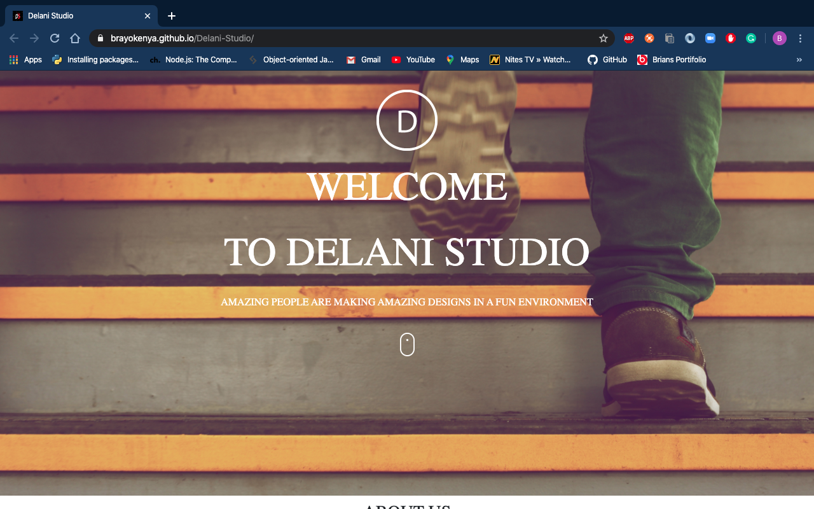

# DELANI STUDIO

#### A landing page for Delani Studio, 9th April 2020

#### By ** Kimani Brian Kiiru**

## Description

This is a landing page for Delani studio. Users visiting the page are able to know more about Delani Studio, the services they offer, view their portfolio and also contact them.

## Development

To make advancements/modifications, follow these steps:

- Fork the repository
- Create a new branch (`git branch gh-pages-v2`)
- Make the appropriate changes in the files
- Add changes made
- Commit your changes (`git commit -m 'Improve feature'`)
- Push to the branch (`git push origin gh-pages-v2`)
- Create a Pull Request

## Setup/Use requirements

- Visit the website at https://brayokenya.github.io/Delani-Studio/
- Click on the What We Do icons to view a short description of the services we offer
- Reach out to us by filling the form in the page

## Technologies Used

This project is written in HTML5, CSS, Bootstrap, jQuery and JavaScript.

## Support and contact details

Should you be unable to access my web application, have any recommendations or questions, feel free to email me; kiirubrian21@gmail.com.

## To-do

1. Validation of email addresses entered

## [License](https://github.com/brayokenya/Delani-Studio/blob/master/LICENCE)

MIT (c) 2020 [Kimani Brian Kiiru](https://github.com/brayokenya)
